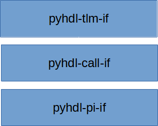

<!--

  
  

    <h1 class="post-title">
      <a href="{{ post.url | absolute_url }}">
        {{ post.title }}
      </a>
    </h1>

    {{ post.date | date_to_string }}

    {{ post.content }}
  

  

 -->

# PyHDL-IF

PyHDL-IF provides libraries for interfacing between Python and various 
Hardware Description Language (HDL) languages and simulation environments.

The PyHDL-IF library stack is shown above:
- **pyhdl-pi-if** - The PyHDL Procedural Interface (PI) implements connections to various 
  HDL programming interfaces (eg VPI, DPI, etc) and exposes the Python C API via these
  interfaces. This allows HDL code to call Python.
- **pyhdl-call-if** - The PyHDL Call Interface implements synchronization mechanisms on
  top of the procedural-interface API to enable cross-calling between Python and HDL.
  This library also provides automation in the form of HDL code generation.
- **pyhdl-tlm-if** - The PyHDL Transaction-Level Model (TLM) interface implements
  a bi-directional TLM interface between Python and HDL intended for use in 
  communicating with Bus Functional Models (BFMs).

The PyHDL-IF libraries are designed to work with or without the use of `cocotb`. 

## Example Usecase: Calling a Python Reference Model from UVM

A wide variety of reference algorithms are available as Python libraries. 
The pyhdl-pi-if makes it easy to call non-time-consuming Python methods 
directly from HDL. This can be used to pass data to a reference model
implemented in Python, and check the correctness of results.

## Example Usecase: Calling UVM API from Python

Creating the structure of a UVM testbench in SystemVerilog can be efficient
due to reusable assets. However, test writers may wish to work in Python.
This can be accomplished by implementing a test API on a SV-UVM virtual 
sequence class, then calling that API from Python. The PyHDL-Call-IF package
enables time-consuming calls from SystemVerilog to invoke co-routines 
in Python, and vice versa.

## Example Usecase: Coordinating cocotb and UVM Testbenches

The synchronization support built into pyhdl-call-if allows UVM 
testbench environments to synchronize with `cocotb` signal-level
testbench environments.

<!--

  
    <a class="pagination-item older" href="{{ paginator.next_page_path | absolute_url }}">Older</a>
  
    Older
  
  
    
      <a class="pagination-item newer" href="{{ '/' | absolute_url }}">Newer</a>
    
      <a class="pagination-item newer" href="{{ paginator.previous_page_path | absolute_url }}">Newer</a>
    
  
    Newer
  

  -->

